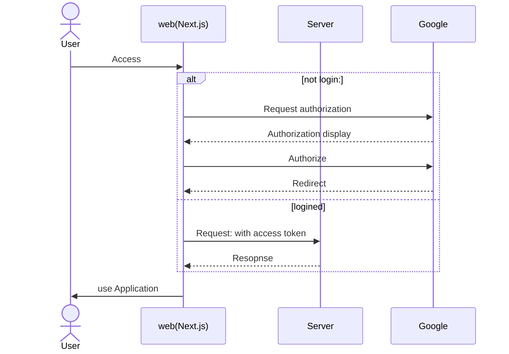

## how to authorization
While using authorization as a substitute for authentication is not a recommended approach, it can be used as an alternative for social login in practice. You can store the access token with an expiration period in a cookie and utilize the access token obtained through Google authorization as a replacement for authentication and session management.